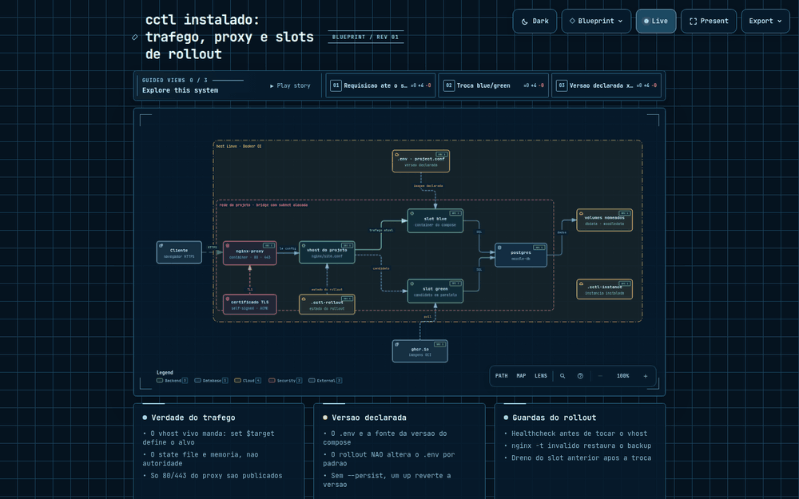

# cctl — containers-control

Orquestrador Bash para ambientes Docker containerizados. Automatiza o ciclo
completo de um projeto: inicialização de diretório, deploy no servidor e operações
do dia a dia — sem dependências externas além do Docker.

## O que resolve

Manter múltiplos ambientes Docker (clientes, projetos, ambientes de homologação)
num mesmo servidor é trabalhoso: senhas geradas manualmente, subnets conflitantes,
vhosts criados à mão, crons esquecidos. O cctl codifica esse processo num único
fluxo reproduzível:

1. **`cctl init`** (local): cria um diretório standalone com os arquivos do template
   renderizados — `.env`, `project.conf`, `docker-compose.yaml` e vhost nginx
2. **`cctl install`** (servidor): gera senhas, aloca subnet, renderiza templates,
   sobe os containers, instala crons e registra o vhost no proxy reverso
3. **Operações do dia a dia**: `ps`, `logs`, `backup`, `connect`, `update` e mais

## Arquitetura

Como uma instância fica depois do `cctl install`: proxy nginx compartilhado,
vhost como fonte da verdade do tráfego (`set $target`), slots blue/green do
rollout, banco, volumes nomeados e os três arquivos que guardam estado
(`.env`, `.cctl-rollout`, `.cctl-instance`).



A versão interativa (zoom, detalhes por nó) está em
[`docs/diagramas/arquitetura-instalado.html`](docs/diagramas/arquitetura-instalado.html)
— abra localmente após clonar o repositório (o GitHub não executa HTML/JS
embutido no README).

## Pré-requisitos

- Docker Engine 24+
- Docker Compose (plugin V2)
- Bash 5.x
- [nginx-proxy](https://github.com/diegobianchetti/nginx-proxy) em execução
  (necessário para `cctl install`)

## Instalação

```bash
git clone https://github.com/diegobianchetti/cctl.git
cd cctl

# Opcional: disponibilizar globalmente
sudo ln -s "$(pwd)/cctl" /usr/local/bin/cctl
```

### Autocomplete

O `cctl` completa comandos, subcomandos, serviços, templates e as flags de
`build`/`rollout`/`ssl`/`proxy`:

```bash
# Opção 1 — system-wide (todos os usuários, todos os shells novos)
sudo apt-get install -y bash-completion    # se ainda não estiver instalado
sudo install -m 0644 cctl-completion.bash /etc/bash_completion.d/cctl

# Opção 2 — só para o seu usuário, persistente entre sessões
echo "source $(pwd)/cctl-completion.bash" >> ~/.bashrc

# Opção 3 — apenas na sessão atual
source cctl-completion.bash
```

A opção 1 exige o pacote `bash-completion`: sem ele, `/etc/bash_completion.d/`
nunca é carregado e o arquivo fica inerte (sem erro visível).

> O `cctl` avisa quando o autocomplete não está carregado, **mas apenas no
> contexto de template** (fora de um projeto/instância) — dentro de uma instância
> o aviso não aparece. Se `cctl <TAB>` não completar, é porque a completion não
> foi carregada naquele shell.

## Fluxo de uso

### 1. Inicialização (na máquina local)


```bash
cctl init moodle moodle-acme
```

O comando solicita o diretório de destino (sugerindo `$(pwd)/moodle-acme/` e
`/opt/moodle-acme/`) e o domínio, depois gera o projeto com tudo preenchido.

> **Nota:** o destino `/opt/<nome>` é recomendado para servidores onde o usuário
> tem permissão de escrita no diretório. Para criar em `/opt`, pré-crie o diretório
> com as permissões corretas antes de rodar o `init`:
> ```bash
> sudo mkdir -p /opt/moodle-acme
> sudo chown "$USER:$USER" /opt/moodle-acme
> ```
> Alternativamente, use `--dest "$HOME/moodle-acme"` para instalar no diretório do usuário.

```
/opt/moodle-acme/
  docker/
    docker-compose.yaml
    .env               ← CLIENT_NAME, COMPOSE_PROJECT_NAME e DOMAIN_NAME preenchidos
  nginx/
    site.conf.template
    site-nossl.conf.template
    moodle-acme.conf   ← vhost de referência (gerado se domínio informado)
  project.conf         ← manifest do projeto
  ...
```

Também aceita flags para uso não-interativo:

```bash
cctl init moodle moodle-acme \
  --domain moodle.acme.example.br \
  --dest /opt/moodle-acme
```

### 2. Instalação (no servidor)

```bash
cd /opt/moodle-acme

# Revisar e ajustar o .env antes de instalar
vi docker/.env

# Instalar
cctl install
```

O `install` gera as senhas, aloca uma subnet dedicada, sobe os containers,
instala os cron jobs e registra o vhost no nginx-proxy.

### 3. Operações

```bash
cctl ps               # lista containers e status
cctl logs             # últimas 50 linhas de log
cctl logs -100        # últimas 100 linhas
cctl logs -f          # segue em tempo real
cctl connect app      # shell no container da aplicação
cctl status           # resumo de saúde do ambiente
cctl backup           # executa backup do ambiente
cctl update           # pull de imagens e recria containers
```

## Ambiente completo de teste/homologação

Passo a passo pra reproduzir uma instalação do zero — VM limpa até aplicação acessível
no browser. Útil pra homologar um template novo ou validar uma alteração no cctl.

### 1. Provisionar a VM

```bash
git clone https://github.com/diegobianchetti/vagrant-libvirt-lab.git
cd vagrant-libvirt-lab
vagrant plugin install vagrant-libvirt
vagrant up
```

Descubra o IP da VM (necessário nos próximos passos):

```bash
virsh domifaddr $(virsh list --all --name | grep lab)
```

### 2. Instalar o Docker na VM

```bash
git clone https://github.com/diegobianchetti/ansible-docker-setup.git
cd ansible-docker-setup

# Aponte um inventory para o IP da VM (usuário vagrant, chave privada do Vagrant)
# e adicione o usuário 'vagrant' ao grupo docker:
ansible-playbook -i <seu-inventory>.yml playbooks/docker-setup.yml \
  -e '{"docker_users": ["vagrant"]}'
```

Sem isso, `docker` só funciona com `sudo` dentro da VM.

### 3. Clonar e disponibilizar o cctl

Dentro da VM (`vagrant ssh`):

```bash
git clone https://github.com/diegobianchetti/cctl.git
cd cctl
sudo ln -s "$(pwd)/cctl" /usr/local/bin/cctl
source cctl-completion.bash
```

### 4. Subir o proxy nginx compartilhado

`cctl proxy` fica disponível em qualquer contexto (repositório do cctl,
diretório de projeto ou instância) — não precisa estar em nenhum diretório
específico:

```bash
cctl proxy up
```

Isso cria a rede Docker compartilhada (`PROXY_NETWORK`, default
`cctl-proxy-net`), os diretórios de vhosts/certificados
(`NGINX_VHOSTS_DIR`, `SSL_CERTS_DIR`, `CERTBOT_WEBROOT_DIR`,
`LETSENCRYPT_DIR`) e sobe o container `nginx-proxy` a partir de
`NGINX_PROXY_IMAGE` (default `ghcr.io/diegobianchetti/nginx-proxy:latest`).

Valide o catch-all antes de seguir — `curl http://localhost` deve fechar a conexão
sem resposta (`return 444`), sinal de que o proxy está de pé e sem vhosts ainda.
Use `cctl proxy status` para conferir container, saúde, portas e rede a
qualquer momento.

### 5. Inicializar e instalar o projeto

```bash
cctl init moodle moodle-acme
```

Responda aos prompts: opção `1` cria no diretório atual, e informe um domínio.

> **Importante para ambiente de lab/teste:** o domínio precisa terminar em `.local`
> ou `.test` (ex.: `moodle-acme.local`) — `cctl install` valida resolução de DNS do
> domínio informado e domínios sem DNS real (incluindo os exemplos fictícios
> `*.example.br` usados no resto desta documentação) falham nessa checagem.

```bash
cd moodle-acme
vi docker/.env        # revise MOODLE_SSL=false se não houver certificado real
cctl install
```

### 6. Validar o acesso

Dentro da VM:

```bash
curl -H "Host: moodle-acme.local" http://localhost
```

Da sua máquina local, adicione o IP da VM ao `/etc/hosts` e acesse pelo browser:

```bash
echo "<IP-da-VM> moodle-acme.local" | sudo tee -a /etc/hosts
```

Depois abra `http://moodle-acme.local` — o mesmo domínio configurado no passo 5.

### 7. Encerrar o lab

```bash
# No host, dentro de vagrant-libvirt-lab/
vagrant destroy -f
```

## Referência de comandos

### Ciclo de vida

| Comando | Descrição |
|---------|-----------|
| `init <template> <nome>` | Inicializa diretório de projeto a partir de um template |
| `install` | Instala a instância no servidor |
| `up` | Cria containers e inicia o ambiente |
| `down` | Remove containers e rede (mantém volumes) |
| `start` | Inicia containers parados |
| `stop` | Para containers em execução |
| `restart` | Reinicia containers |
| `destroy` | Teardown completo da instância |

### Monitoramento

| Comando | Descrição |
|---------|-----------|
| `ps` | Lista containers do ambiente |
| `logs [serviço]` | Exibe logs. Sem args: últimas 50 linhas. `-N`: últimas N linhas. `-f`: segue |
| `status` | Resumo de saúde do ambiente |
| `network` | Detalhes da rede Docker (subnet, IPs) |
| `volumes` | Lista volumes e bind mounts |
| `list` | Lista instâncias instaladas no servidor |

### SSL

| Comando | Descrição |
|---------|-----------|
| `ssl status [domínio]` | Modo SSL, caminho do certificado e data de expiração |
| `ssl issue [domínio]` | Emite/instala o certificado conforme `SSL_MODE` |
| `ssl renew [domínio]` | Renova o certificado conforme `SSL_MODE` |

Domínio é opcional — usa `DOMAIN_NAME` do manifest quando omitido. Modos
suportados em `SSL_MODE` (`project.conf`): `self-signed` (par autoassinado via
OpenSSL, dev/homologação), `letsencrypt` (Certbot via webroot compartilhado
com o proxy), `manual` (certificados fornecidos pelo usuário via
`SSL_CERT_FILE`/`SSL_KEY_FILE`) e `none` (sem SSL, fallback HTTP puro).

### Proxy nginx compartilhado

| Comando | Descrição |
|---------|-----------|
| `proxy up` | Sobe a infraestrutura do proxy (rede + diretórios + container) |
| `proxy down` | Para e remove o container do proxy |
| `proxy reload` | Testa e recarrega a configuração nginx |
| `proxy test` | Testa a sintaxe da configuração (todos os vhosts) |
| `proxy logs [flags]` | Encaminha argumentos extras para `docker logs` |
| `proxy status` | Status do container, saúde, portas e rede |

Disponível em qualquer contexto (repositório do cctl, projeto ou instância) —
gerencia o container `nginx-proxy` compartilhado por todas as instâncias do
host.

### Rollout (Blue/Green)

| Comando | Descrição |
|---------|-----------|
| `rollout bluegreen [--service <svc>] [--image <ref>] [opções]` | Sobe a versão candidata em slot paralelo, testa a saúde e troca o tráfego no nginx sem downtime |
| `rollout rolling [--service <svc>] [--image <ref>] [opções]` | Recreate seguro do slot atual (mesmo alias), com rollback automático se o healthcheck falhar |
| `rollout status [--service <svc>]` | Slot live, container, saúde, alvo do vhost e imagem em uso |
| `rollout help` | Exibe o uso sintético de `cctl rollout` |

Opções comuns aos dois modos: `--health-mode auto|docker|http`, `--timeout <s>`,
`--health-path <p>`, `--health-port <p>`. Exclusivas do `bluegreen`: `--drain <s>`
(segundos de dreno antes de derrubar o slot antigo) e `--keep-old` (não derruba
o slot anterior). Detalhes do modelo de slots, limitações conhecidas e exemplo
completo em [docs/USAGE.md](docs/USAGE.md#rollout-bluegreen).

### Manutenção

| Comando | Descrição |
|---------|-----------|
| `connect <serviço>` | Abre shell no container do serviço |
| `build [serviço...]` | Build/rebuild de imagens (todas as com `build:` no compose, ou só as indicadas) |
| `build --no-cache` \| `--pull` | Repassa a flag ao `docker compose build` |
| `build -t/--tag <tag>` | Aplica tag customizada às imagens construídas |
| `build --custom <serviço>` | Build via Dockerfile customizado do projeto (`docker/custom/<serviço>/Dockerfile`, override em `CUSTOM_BUILD_DIR`) |
| `build --push [--registry <url>]` | Publica as imagens construídas/taggeadas no registry (default `${CCTL_REGISTRY:-ghcr.io/${DOCKER_OWNER}}`) |
| `update` | Pull de imagens e recria containers |
| `backup` | Executa backup do ambiente |
| `config` | Exibe configuração resolvida |
| `db-check-config` | Verifica config customizada do banco |
| `db-update-config` | Aplica config customizada no banco |

Credenciais de push: `CCTL_REGISTRY_USER` + `CCTL_REGISTRY_TOKEN` (ou
`GHCR_TOKEN`/`DOCKER_TOKEN`), nunca como argumento de linha de comando.
Detalhes em [docs/USAGE.md](docs/USAGE.md#build-de-imagens-customizadas-cctl-build).

### Limpeza (destrutivo)

| Comando | Descrição |
|---------|-----------|
| `clear-volumes` | Remove volumes (dados permanentes apagados) |
| `clear-all` | Remove tudo: containers, volumes, configs |

## Estrutura

```
cctl                    # Entry point e dispatcher
cctl.conf               # Defaults globais (registry, paths)
cctl-completion.bash    # Autocomplete para bash
lib/                    # Funções compartilhadas
  core.sh               # Detecção de contexto, variáveis globais
  colors.sh             # Cores e formatação de output
  log.sh                # Funções de log (msg_info, msg_error, etc.)
  env.sh                # Leitura e escrita do .env
  validate.sh           # Validações de pré-requisitos
  compose.sh            # Wrappers do docker compose
  network.sh            # Alocação de subnets
  nginx.sh              # Integração com nginx-proxy
commands/               # Um arquivo por subcomando
  init.sh               # Inicializa diretório de projeto
  install.sh            # Deploy completo no servidor
  logs.sh               # Exibe logs
  ps.sh                 # Lista containers
  ...                   # Demais comandos
templates/              # Um diretório por tipo de projeto
  moodle/               # Template para Moodle
  dspace/               # Template para DSpace
docs/
  TEMPLATE_GUIDE.md     # Como criar um novo template
```

## Detecção de contexto

O cctl detecta automaticamente onde está sendo executado e exibe apenas os
comandos disponíveis para aquele contexto:

| Contexto | Condição | Comandos disponíveis |
|----------|----------|----------------------|
| Repositório cctl | fora de projeto/instância | `init`, `proxy` |
| Diretório de projeto (pré-install) | `project.conf` presente, sem `.cctl-instance` | `install`, `ssl`, `proxy` |
| Instância instalada | `.cctl-instance` presente | todos os operacionais |

## Templates disponíveis

| Template | Aplicação | Documentação |
|----------|-----------|--------------|
| `moodle` | Moodle LMS | — |
| `dspace` | DSpace (repositório institucional) | — |

Para criar um novo template (ex: GitLab, WordPress, Nextcloud), consulte
[docs/TEMPLATE_GUIDE.md](docs/TEMPLATE_GUIDE.md).

## Decisões técnicas

### Por que Bash puro, sem yq, jq ou Python?

O cctl roda em servidores que muitas vezes têm apenas o mínimo instalado.
Dependências externas viram pré-requisito de instalação — e pré-requisito de
manutenção. Bash 5 + coreutils cobrem tudo que o cctl precisa: parsing de
variáveis, manipulação de strings, chamadas a `docker`. A única dependência
real é o Docker, que já é o pré-requisito do próprio workload. O `jq` foi o
último resquício disso — usado de forma opcional em `cctl volumes` para
listar bind mounts — e saiu de circulação: `lib/volumes.sh` parseia o YAML
resolvido de `docker compose config` por indentação, mesma técnica já usada
por `compose_buildable_services`/`compose_service_image` (`lib/compose.sh`)
para achar serviços com `build:` e resolver a imagem de um serviço.

### Por que um diretório por projeto em vez de branches git?

Branches no repositório do cctl exigem que cada usuário faça fork da ferramenta
para gerenciar seus projetos — o histórico do cliente fica misturado com o
histórico da ferramenta. Com o modelo de diretório standalone, `cctl init` gera
um diretório autocontido que o usuário pode ou não versionar, em qualquer
repositório git que queira. O cctl é apenas a ferramenta; o projeto é do usuário.

### Por que `{{DOUBLE_BRACES}}` nos templates nginx em vez de `$VARIAVEL`?

Templates com `$VAR` exigem `envsubst` e colidem com variáveis do nginx
(`$host`, `$uri`, `$remote_addr`). `{{DOUBLE_BRACES}}` não colide com shell,
nginx, nem com outros sistemas de template. A substituição é feita com `sed`,
tornando cada render explícito e auditável.

### Por que `_PLACEHOLDER_` no `.env.template`?

O arquivo `.env` é lido linha por linha via `read` — sem expansão de shell.
Placeholders com `_UNDERSCORES_` são visualmente distintos de variáveis reais,
improváveis de conflitar com valores legítimos, e seguros para substituição
com `sed`.

### Por que detecção de contexto em vez de subcomandos fixos?

O mesmo binário `cctl` serve tanto na máquina do desenvolvedor (onde faz sentido
`init`) quanto no servidor (onde faz sentido `install`, `ps`, `logs`). Expor
todos os comandos em todos os contextos gera confusão e risco de operação
errada. A detecção automática garante que o operador veja — e possa executar —
apenas o que faz sentido no ambiente onde está.

## Licença

MIT
