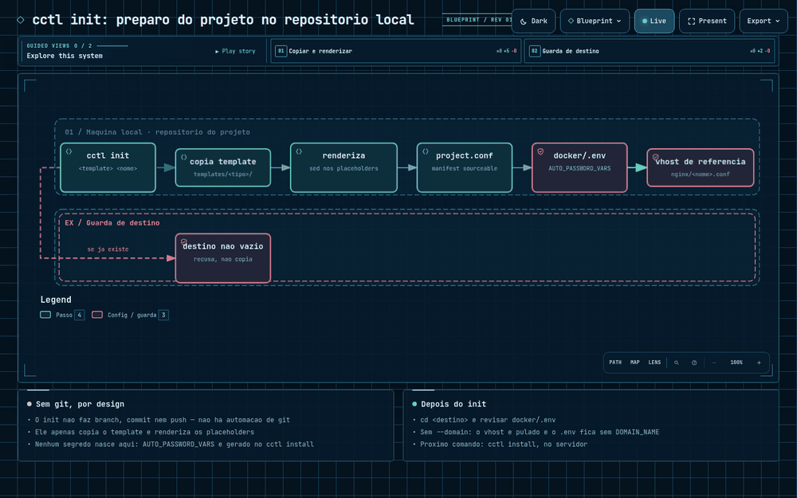
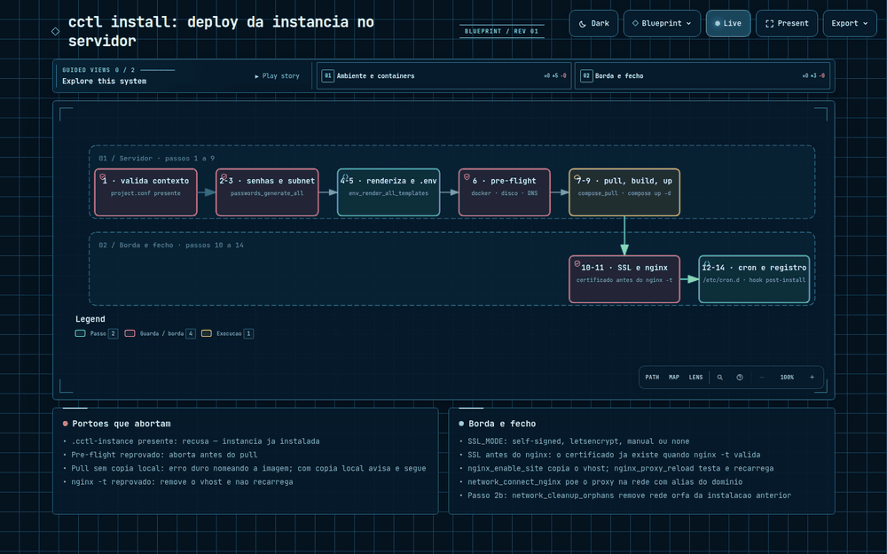

# cctl — Guia de Uso

Orquestrador generico para ambientes Docker containerizados.
Unifica o gerenciamento de projetos DSpace e Moodle.

---

## Sumario

1. [Requisitos](#requisitos)
2. [Conceitos](#conceitos)
3. [Fluxo completo](#fluxo-completo)
4. [Referencia de comandos](#referencia-de-comandos)
5. [Exemplos por projeto](#exemplos-por-projeto)
6. [Estrutura de um template](#estrutura-de-um-template)
7. [Customizacao](#customizacao)
8. [Troubleshooting](#troubleshooting)

---

## Requisitos

- Docker >= 24.0 com Docker Compose v2
- Bash >= 4.4
- Git
- **`sudo`** no servidor — requisito, não opcional: o `cctl` roda como usuário
  normal, mas exige permissão de sudo. Usado para a raiz de dados
  (`CCTL_BASE_DIR`, na primeira vez), para escrever em `LETSENCRYPT_DIR`
  (fica root-owned de propósito — guarda chave privada) e para os arquivos
  fixos de `/etc/cron.d`/`/etc/logrotate.d` — depois do `cctl proxy up`
  inicial (que ajusta o dono da árvore para o usuário que o invocou), o dia a
  dia (`install`, `up`, `backup`, `rollout`) não pede senha. **`certbot` não
  é requisito do host** — a emissão/renovação roda dentro do container
  `nginx-proxy` via `docker exec`.
- Acesso ao registry configurado em `DOCKER_OWNER` para pull das imagens

### Layout no host

Tudo o que o `cctl` grava no host fica sob uma raiz única,
**`CCTL_BASE_DIR`** (default `/opt/cctl`, sobrescrevível por variável de
ambiente) — instâncias, vhosts, certificados e diretório do Let's Encrypt
derivam dela. As duas exceções são `/etc/cron.d` e `/etc/logrotate.d`,
fixos por contrato do cron/logrotate (leem de caminho fixo do sistema,
root-owned). Rode `cctl paths` a qualquer momento para ver as raízes
efetivas, se existem e se são graváveis.

---

## Conceitos

### Contextos

O `cctl` detecta automaticamente onde esta sendo executado e libera apenas os comandos validos para aquele contexto:

| Contexto | Deteccao | Comandos disponiveis |
|----------|----------|---------------------|
| **template** | Diretorio `templates/` presente (repositorio do cctl) | `init`, `proxy`, `paths`, `help` |
| **project** | `project.conf` presente, sem `.cctl-instance` | `install`, `ssl`, `proxy`, `paths`, `help` |
| **instance** | `.cctl-instance` presente | Todos os operacionais (up, down, logs, backup, ssl, proxy, rollout, paths...) |

### Manifest (project.conf)

Cada template tem um `project.conf` que declara tudo sobre o projeto: compose files, variaveis obrigatorias, senhas auto-geradas, configuracao de nginx/cron/SSL, etc. O `cctl` le esse arquivo para saber como operar.

### Placeholders

- **`_PLACEHOLDER_`** (underscores) — usados no `.env.template`, substituidos durante `init` e `install`
- **`{{PLACEHOLDER}}`** (double braces) — usados em templates de config (nginx, cron), substituidos durante `install`

---

## Fluxo completo



Versoes interativas (zoom, detalhes por no) dos diagramas desta secao estao
em `docs/diagramas/*.html` — abra localmente apos clonar o repositorio (o
GitHub nao executa HTML/JS embutido em Markdown).

### Passo 1: Inicializar (maquina local ou servidor)

`cctl init` roda em qualquer diretorio, a partir do `cctl` disponibilizado
globalmente (symlink) ou do proprio repositorio clonado:

```bash
cctl init <template> <nome> [--domain <dominio>] [--dest <caminho>]

# Exemplo:
cctl init moodle moodle-acme --domain moodle.acme.example.br
```

Sem `--dest`, o comando pergunta o diretorio de destino (diretorio atual,
`/opt/<nome>` ou um caminho customizado); sem `--domain`, pergunta o dominio
(Enter pula e deixa para editar depois no `.env`).

O que acontece (ver `commands/init.sh`):
1. Valida o nome do projeto e o template (`templates/<tipo>/`)
2. Cria o diretorio de destino e copia o template inteiro
3. Copia `docker/.env.template` para `docker/.env` e renderiza os
   placeholders `_CLIENT_NAME_`/`_COMPOSE_PROJECT_NAME_`/`_DOMAIN_NAME_` no
   `.env` e no `project.conf`
4. Gera um vhost nginx de referencia em `nginx/<nome>.conf` (so se o dominio
   foi informado)

**Nao ha nenhuma automacao de git** — sem branch, sem commit, sem push. O
`init` so copia arquivos e renderiza texto; o versionamento do diretorio
gerado (se houver) e decisao do usuario, em qualquer repositorio que queira.

Ao final, imprime o proximo passo (`cd <dest>`, revisar o `.env`, `cctl install`).

### Passo 2: Instalar (servidor)



No servidor de producao, dentro do diretorio gerado pelo `init`:

```bash
cd /opt/moodle-acme
vi docker/.env       # revisar antes de instalar
cctl install
```

O que acontece (a ordem e a dos passos numerados em `commands/install.sh`):
1. Limpa rede orfa deixada por uma instalacao/`down` anterior que falhou
2. Gera senhas automaticas (definidas em `AUTO_PASSWORD_VARS`)
3. Aloca subnet Docker livre no range configurado
4. Renderiza templates (nginx, cron) com as variaveis do `.env`
5. Recarrega o `.env` com as senhas e a subnet ja geradas
6. Valida pre-requisitos: **docker, espaco em disco e DNS do `DOMAIN_NAME`**
   (dominios `localhost`, `*.local` e `*.test` sao pulados; um dominio que
   nao resolva — nem por DNS nem por `/etc/hosts` — **aborta o install**)
7. Pull das imagens do registry
8. Build condicional (so se algum servico do compose tiver contexto `build:`)
9. Sobe os containers (`docker compose up -d`)
10. Emite o certificado SSL (se `HOST_SSL=true`)
11. Configura nginx no host (se `HOST_NGINX=true`)
12. Instala cron jobs (se `HOST_CRON=true`)
13. Executa hook pos-instalacao
14. Grava `.cctl-instance` (marca como instalado)

> **SSL vem antes do nginx, de proposito:** o vhost final so e testado com
> `nginx -t` depois que o certificado existe. Quando o modo e `letsencrypt` e o
> certificado ainda nao foi emitido, o install publica um vhost HTTP temporario
> so para o desafio ACME e depois troca pelo definitivo.
>
> O pre-flight **nao** verifica portas: `validate_port_available` existe em
> `lib/validate.sh` mas nao e chamada pelo `install`.

### Passo 3: Operar (servidor)

Apos instalado, todos os comandos operacionais ficam disponiveis:

```bash
./cctl ps          # containers rodando
./cctl logs        # ver logs
./cctl status      # saude do ambiente
```

---

## Referencia de comandos

### Inicializacao

| Comando | Descricao |
|---------|-----------|
| `cctl init <template> <nome> [--domain <dominio>] [--dest <caminho>]` | Copia o template para um diretorio novo e renderiza `.env`/`project.conf`/vhost. Sem automacao de git |
| `cctl install` | Instala a instancia no servidor (deploy completo) |
| `cctl ssl <status\|issue\|renew> [dominio]` | Gerencia o certificado SSL conforme `SSL_MODE` |
| `cctl proxy <up\|down\|reload\|test\|logs\|status>` | Gerencia o proxy nginx compartilhado (disponivel em qualquer contexto) |

### Ciclo de vida

| Comando | Descricao |
|---------|-----------|
| `cctl up` | Cria containers e inicia o ambiente |
| `cctl down` | Remove containers e rede (mantem volumes) |
| `cctl start` | Inicia containers parados |
| `cctl stop` | Para containers em execucao |
| `cctl restart` | Reinicia containers |

### Monitoramento

| Comando | Descricao |
|---------|-----------|
| `cctl ps` | Lista containers do ambiente |
| `cctl logs [servico]` | Exibe logs (todos ou de um servico especifico) |
| `cctl status` | Resumo de saude (containers, rede, disco, SSL) |
| `cctl network` | Detalhes da rede Docker (subnet, IPs alocados) |
| `cctl volumes` | Lista volumes e bind mounts |
| `cctl config` | Exibe configuracao resolvida |

### SSL

| Comando | Descricao |
|---------|-----------|
| `cctl ssl status [dominio]` | Modo SSL, caminho do certificado e data de expiracao |
| `cctl ssl issue [dominio]` | Emite/instala o certificado conforme `SSL_MODE` |
| `cctl ssl renew [dominio]` | Renova o certificado conforme `SSL_MODE` |
| `cctl ssl help` | Exibe esta ajuda |

Dominio e opcional em todas as acoes — usa `DOMAIN_NAME` do manifest quando
omitido. Disponivel em contexto `instance` e `project`. Modos suportados em
`SSL_MODE` (`project.conf`):

| Modo | Descricao |
|------|-----------|
| `self-signed` | Par autoassinado gerado na hora via OpenSSL (dev/homologacao) |
| `letsencrypt` | Certbot via webroot compartilhado com o proxy |
| `manual` | Certificados fornecidos pelo usuario (`SSL_CERT_FILE`/`SSL_KEY_FILE`) |
| `none` | Sem SSL — fallback puramente HTTP |

### Proxy nginx compartilhado

| Comando | Descricao |
|---------|-----------|
| `cctl proxy up` | Sobe a infraestrutura do proxy (rede + diretorios + container) |
| `cctl proxy down` | Para e remove o container do proxy |
| `cctl proxy reload` | Testa e recarrega a configuracao nginx |
| `cctl proxy test` | Testa a sintaxe da configuracao (todos os vhosts) |
| `cctl proxy logs [flags]` | Encaminha argumentos extras para `docker logs` |
| `cctl proxy status` | Status do container, saude, portas e rede |

Disponivel em qualquer contexto (`template`, `project`, `instance` ou
desconhecido) — gerencia o container `nginx-proxy` (`NGINX_PROXY_IMAGE`,
default `ghcr.io/diegobianchetti/nginx-proxy:latest`) compartilhado por todas
as instancias do host, na rede `PROXY_NETWORK` (default `cctl-proxy-net`).

### Acesso e manutencao

| Comando | Descricao |
|---------|-----------|
| `cctl connect <servico>` | Abre shell (bash) no container |
| `cctl build [servico...]` | Build/rebuild de imagens (todas ou so as indicadas) |
| `cctl build --no-cache` \| `--pull` | Repassa a flag ao `docker compose build` |
| `cctl build -t/--tag <tag>` | Aplica tag customizada as imagens construidas |
| `cctl build --custom <servico>` | Build via Dockerfile customizado do projeto |
| `cctl build --push [--registry <url>]` | Publica as imagens construidas no registry |
| `cctl update` | Pull de imagens atualizadas e recria containers |
| `cctl backup` | Executa backup (dump do banco + volumes) |
| `cctl list` | Lista instancias instaladas no servidor |

### Rollout (Blue/Green)

| Comando | Descricao |
|---------|-----------|
| `cctl rollout bluegreen [--service <svc>] [--image <ref>]` | Sobe a nova versao em slot paralelo, testa saude e troca o trafego no nginx sem downtime |
| `cctl rollout rolling [--service <svc>] [--image <ref>]` | Recreate seguro do slot atual (mesmo alias), com rollback automatico se o healthcheck falhar |
| `cctl rollout status` | Slot live, container, saude, alvo do vhost e imagem em uso |
| `cctl rollout help` | Exibe o uso sintetico de `cctl rollout` |
| `--health-mode auto\|docker\|http` | Estrategia de sonda (default `auto`: usa `docker` se o servico declara `healthcheck:`, senao `http`) |
| `--timeout <s>` \| `--health-path <p>` \| `--health-port <p>` | Ajustam o healthcheck (timeout total, path e porta da sonda HTTP) |
| `--drain <s>` \| `--keep-old` | [somente `bluegreen`] Segundos de dreno antes de derrubar o slot antigo, ou mantem-lo no ar |

#### Modelo de slots

- **slot blue**: o container gerenciado pelo `docker compose` normalmente (`${COMPOSE_PROJECT_NAME}-<svc>`, alias de rede `<svc>`).
- **slot green**: um container paralelo, subido a partir de um override de compose gerado em runtime (`docker-compose.rollout.yaml`, sempre removido ao final — inclusive em erro), com `container_name: ${COMPOSE_PROJECT_NAME}-<svc>-green` e `hostname: <svc>-green` via `extends:` do compose base. O override e gerado no mesmo diretorio do arquivo de `COMPOSE_FILES` que efetivamente **define** o servico (nem sempre o primeiro — ex.: template `dspace`, onde `dspace-angular` esta no segundo arquivo), e o `extends.file` aponta para o basename desse arquivo (nunca um caminho com `/`) porque o `docker compose` resolve `extends.file` relativo ao diretorio do proprio override, nao ao CWD.
- O slot **live** alterna a cada rollout bem-sucedido. O candidato e sempre o slot que nao esta live.
- O vhost do nginx usa `resolver 127.0.0.11; set $target <alias>:<porta>; proxy_pass <scheme>://$target;` — o Blue/Green so precisa trocar o alias dessa linha e recarregar o nginx (`nginx -t` + `nginx -s reload`) para mudar o trafego, sem `upstream` estatico.
- **O switch reescreve o vhost VIVO em `NGINX_VHOSTS_DIR` (`${CCTL_BASE_DIR}/nginx-proxy/vhosts.d/<projeto>.conf`, default `/opt/cctl/nginx-proxy/vhosts.d/<projeto>.conf`), nunca o `./nginx/site.conf` da instancia.** O `site.conf` continua sendo apenas o render base gerado pelo `cctl install` — depois do primeiro rollout ele nao reflete mais o slot ativo. `cctl rollout status` (ou a leitura direta do vhost vivo) e a fonte da verdade sobre para onde o trafego esta indo, nunca o `site.conf` da instancia.
- Estado do rollout (slot live, alvo, imagem, data) fica em `ROLLOUT_STATE_FILE` (default `.cctl-rollout`, na raiz da instancia) — sourceable, mas lido por parsing (nunca dado `source` diretamente pelo cctl). A porta gravada no estado (`LIVE_TARGET`) e sempre a porta do servico/vhost — `--health-port` fica restrito a porta usada pela sonda de saude, que pode divergir.

#### Exemplo (dominio ficticio)

```bash
# instancia ja com "cctl proxy up" e "cctl install" feitos, app.acme.example.br no ar
cctl rollout bluegreen --service moodle-app --image ghcr.io/acme/moodle-app:2.5.1 \
    --timeout 90 --health-path /login/index.php --drain 15

cctl rollout status
# Servico:        moodle-app
# Slot live:      green
# Container:      acme-moodle-app-green
# Status:         running
# Saude:          healthy
# Alvo do vhost:  moodle-app-green:443
# Imagem:         ghcr.io/acme/moodle-app:2.5.1
# Ultimo rollout: 2026-09-12T21:00:00-03:00

# Recreate seguro (mesmo alias, sem troca de trafego), com rollback automatico:
cctl rollout rolling --service moodle-app --image ghcr.io/acme/moodle-app:2.5.2
```

#### Limitacoes conhecidas

- O dreno do slot anterior e por **tempo fixo** (`--drain`/`ROLLOUT_DRAIN_SECONDS`), nao por contagem de conexoes ativas — conexoes mais longas que o dreno sao encerradas.
- A sonda HTTP roda **de dentro da rede do projeto**, via `docker exec` no container de sonda (default: o proxy nginx) — sem uma sonda com `curl`/`wget` disponivel no container, o modo `http` falha com erro claro.
- O override de compose usa `extends:`, um recurso do `docker compose` validado com `docker compose` real na VM de lab (heranca de `depends_on`, `--no-deps` subindo somente o candidato); a suite de testes automatizados continua usando mocks e nao pode atestar o `extends:` em si (ver `WORK_LOG.md`/handoff da Sprint 5).
- `cctl rollout rolling` **nao** serve para introduzir um segundo slot: o candidato e sempre o proprio servico do compose (`--force-recreate`), o que implica um breve intervalo sem esse container durante a recriacao.
- **A imagem nova do rollout NAO e persistida em lugar nenhum** — o override runtime (`docker-compose.rollout.yaml`) e efemero e sempre removido ao final. O `.env`/compose da instancia continuam declarando a imagem antiga; um `cctl up` ou `cctl update` posterior **reverte silenciosamente** a versao em producao para o que estiver no `.env`. O rollout (`bluegreen`/`rolling`) e o mecanismo de troca de trafego/recreate seguro, nao o mecanismo de persistir a versao — para tornar a nova imagem permanente, atualize a variavel de imagem correspondente no `.env` da instancia apos confirmar o rollout.
- **O restante do `cctl` nao conhece o slot green.** `cctl ps`, `cctl stop`, `cctl down` e `cctl up` operam apenas sobre o compose base (sem o override do rollout) — o container `<svc>-green` aparece para eles como um container "orfao" da rede/projeto. Em particular, `cctl up --remove-orphans` (ou o equivalente `docker compose ... --remove-orphans`) pode derrubar o slot green **mesmo que ele esteja em trafego** apos um rollout. Evite `--remove-orphans` em instancias com um rollout Blue/Green ativo; confira `cctl rollout status` antes.

### Banco de dados

| Comando | Descricao |
|---------|-----------|
| `cctl db-check-config` | Verifica se config customizada do banco esta aplicada |
| `cctl db-update-config` | Aplica config customizada no banco |

### Limpeza (destrutivos)

| Comando | Descricao |
|---------|-----------|
| `cctl clear-volumes` | Remove volumes (dados permanentes!) |
| `cctl clear-all` | Remove tudo: containers, volumes, rede, nginx, cron |
| `cctl destroy` | Teardown completo + apaga o diretorio da instancia |

### Opcoes globais

| Opcao | Descricao |
|-------|-----------|
| `--version`, `-v` | Exibe a versao do cctl |
| `--help`, `-h` | Exibe ajuda (contextual) |
| `--verbose` | Saida detalhada com debug |

---

## Exemplos por projeto

### DSpace

```bash
# Local ou servidor — inicializar o diretorio do projeto:
cctl init dspace dspace-acme --domain repositorio.acme.example.com

# Servidor — instalar (dentro do diretorio gerado pelo init, ou apos copia-lo
# para o servidor por qualquer meio — scp, git do usuario, rsync):
cd /opt/dspace-acme
./cctl install

# Operacao:
./cctl ps
./cctl logs dspace           # logs do backend
./cctl logs dspace-angular   # logs do frontend
./cctl connect dspacedb      # shell no PostgreSQL
./cctl backup
```

Servicos DSpace: `dspace` (backend), `dspace-angular` (frontend), `dspacedb` (PostgreSQL), `dspacesolr` (Solr)

### Moodle

```bash
# Local ou servidor — inicializar o diretorio do projeto:
cctl init moodle moodle-acme --domain moodle.acme.example.com

# Servidor — instalar:
cd /opt/moodle-acme
./cctl install

# Operacao:
./cctl ps
./cctl logs moodle-app
./cctl connect moodle-db
./cctl db-check-config       # verifica custom-postgresql.conf
./cctl backup
```

Servicos Moodle: `moodle-app`, `moodle-db`

---

## Estrutura de um template

Cada template em `templates/<tipo>/` segue esta estrutura:

```
templates/<tipo>/
  project.conf              # Manifest (obrigatorio)
  docker/
    .env.template           # Variaveis de ambiente
    docker-compose.yaml     # Compose principal
  nginx/
    site.conf.template      # Config nginx (opcional)
  cron/
    *.template              # Cron jobs (opcional)
  scripts/
    post-install.sh         # Hook pos-install (opcional)
  custom-config/            # Configs especificas do projeto
```

### Campos do project.conf

| Campo | Descricao | Exemplo |
|-------|-----------|---------|
| `PROJECT_TYPE` | Tipo do projeto | `"dspace"` |
| `ENV_FILE` | Caminho do .env | `"docker/.env"` |
| `ENV_TEMPLATE` | Caminho do template do .env | `"docker/.env.template"` |
| `COMPOSE_FILES` | Array de compose files | `("docker/docker-compose.yaml")` |
| `TEMPLATE_FILES` | Templates a renderizar (src:dst) | `("nginx/site.conf.template:nginx/site.conf")` |
| `AUTO_PASSWORD_VARS` | Senhas geradas automaticamente | `("POSTGRES_PASSWORD")` |
| `REQUIRED_VARS` | Vars validadas antes do deploy | `("DOMAIN_NAME" "POSTGRES_PASSWORD")` |
| `HOST_NGINX` | Configura nginx no host | `true` / `false` |
| `HOST_SSL` | Emite certificado SSL | `true` / `false` |
| `SSL_MODE` | Tipo de SSL | `"letsencrypt"` / `"manual"` |
| `HOST_CRON` | Instala cron jobs no host | `true` / `false` |
| `DB_SERVICE` | Nome do servico de banco | `"dspacedb"` |
| `DB_TYPE` | Tipo do banco | `"postgresql"` |
| `CONNECTABLE_SERVICES` | Servicos que aceitam `cctl connect` | `("dspace" "dspacedb")` |
| `SUBNET_RANGE` | Range para alocacao de subnet | `"10.88.0.0/16"` |
| `HOOK_POST_INSTALL` | Script pos-install | `"post-install.sh"` |

---

## Customizacao

### Ajustar limites de recursos

Edite o `.env` da instancia (ou `.env.template` no template) e altere os valores de memoria e CPU:

```bash
DSPACE_MEMORY_LIMIT=4G
DSPACE_CPU_LIMIT=4
POSTGRESQL_MEMORY_LIMIT=1G
```

Depois aplique com:

```bash
./cctl down && ./cctl up
```

### SSL manual (certificado proprio)

No `project.conf`, configure:

```bash
HOST_SSL=true
SSL_MODE="manual"
```

No `.env`, informe os caminhos:

```bash
SSL_CERT_FILE="/caminho/do/certificado.pem"
SSL_KEY_FILE="/caminho/da/chave.key"
```

### Adicionar novo template

1. Crie `templates/<novo>/` com `project.conf`, `.env.template`, compose, etc.
2. Siga a estrutura dos templates existentes como referencia
3. O template ficara automaticamente disponivel no `cctl init`

### Build de imagens customizadas (`cctl build`)

`cctl build` sem argumentos compila todas as imagens com `build:` definido no
compose do projeto (comportamento padrao do `docker compose build`). Para
compilar so alguns servicos, informe os nomes; um servico inexistente falha
com a lista dos servicos disponiveis, sem chamar o Docker:

```bash
cctl build                    # todas as imagens com build: no compose
cctl build moodle-app          # so o servico moodle-app
cctl build --no-cache --pull   # forca rebuild sem cache e atualiza imagens base
```

#### Dockerfile customizado do projeto

Para builds fora do compose (imagem propria, nao definida como `build:` de
nenhum servico do template), a convencao e um diretorio por servico:

```
docker/custom/<servico>/Dockerfile
```

O contexto de build e o proprio diretorio `docker/custom/<servico>/`. O
diretorio base pode ser sobrescrito com a variavel `CUSTOM_BUILD_DIR`. Exemplo
completo — build customizado, tag e publicacao no registry:

```bash
cctl build --custom moodle-app --tag v1.2.0 --push
```

#### Publicando no registry (`--push`)

O registry alvo e `${CCTL_REGISTRY:-ghcr.io/${DOCKER_OWNER}}`, sobrescrevivel
com `--registry <url>`. Autenticacao usa `CCTL_REGISTRY_USER` +
`CCTL_REGISTRY_TOKEN` (ou `GHCR_TOKEN`/`DOCKER_TOKEN`) via
`docker login --password-stdin` — **o token nunca deve ser passado como
argumento de linha de comando** (fica visivel em `ps`/historico/logs).
Exporte-o so na sessao do shell ou num secret do CI:

```bash
export CCTL_REGISTRY_USER="diegobianchetti"
export CCTL_REGISTRY_TOKEN="$(cat /caminho/seguro/token)"
cctl build --push
```

Sem token no ambiente, `cctl build --push` reaproveita uma sessao ja
autenticada em `~/.docker/config.json` (`docker login` manual previo); sem
token e sem sessao, falha com erro claro antes de tentar qualquer login.

---

## Troubleshooting

### "Este nao e um diretorio de instancia"

Voce esta rodando um comando operacional fora do diretorio da instancia. Navegue ate o diretorio correto:

```bash
cd <diretorio-onde-o-cctl-init-foi-executado>/<projeto>-<cliente>
# convencao: sob CCTL_INSTANCE_BASE_DIR (default /opt/cctl/instances) — ver 'cctl paths'
```

### "Instancia ja instalada"

O `cctl install` so pode ser executado uma vez. Use `cctl up/down/restart` para operar.

### Containers nao sobem

```bash
./cctl logs              # ver erros
./cctl status            # checar saude geral
./cctl config            # verificar variaveis resolvidas
```

### Problemas com nginx

O proxy nao e um projeto compose: ele sobe por `docker run --name nginx-proxy`
(ver `nginx_proxy_up` em `lib/nginx.sh`), entao comandos do tipo
`docker compose -p nginx exec ...` **nao funcionam**. Use o subcomando:

```bash
cctl proxy test          # valida a config (docker exec nginx-proxy nginx -t)
cctl proxy logs -f       # acompanha os logs (args repassados ao docker logs)
cctl proxy reload        # recarrega a config sem derrubar o container
cctl proxy status        # container, saude, portas e rede do proxy
```

### Reset completo (perda de dados!)

```bash
./cctl clear-all         # remove containers, volumes, nginx, cron
./cctl install           # reinstala do zero
```

### Destruir instancia

```bash
./cctl destroy           # pede confirmacao digitando o nome do projeto
```
